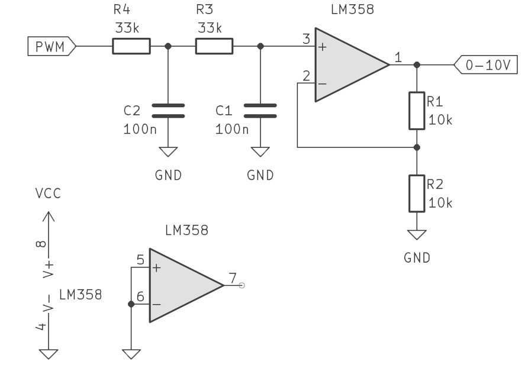

# Description

Build this PWM to 0-10V converter with only a few standard components.  
Works with 3.3V or 5V PWM signals, runs on 12...24V power.
Watch the video below to see how it works, the LTSpice simulation and a live demonstration with a 0-10V dimmable LED driver!  

# Check out the video:

# Schematic of the PWM to 0-10V converter:  
This schematic is for 5V logic (Atmega, Arduino).  
For 3.3V logic (ESP32, STM32) please change R1 from 10kΩ to 20kΩ.  

# Files:  
  
-Schematic file (jpg)  
-LTSpice simulation ("Vanilla LTSpice" no dependencies)  
-Arduino Nano PWM demo cosde to test the circuit ("fade")  
